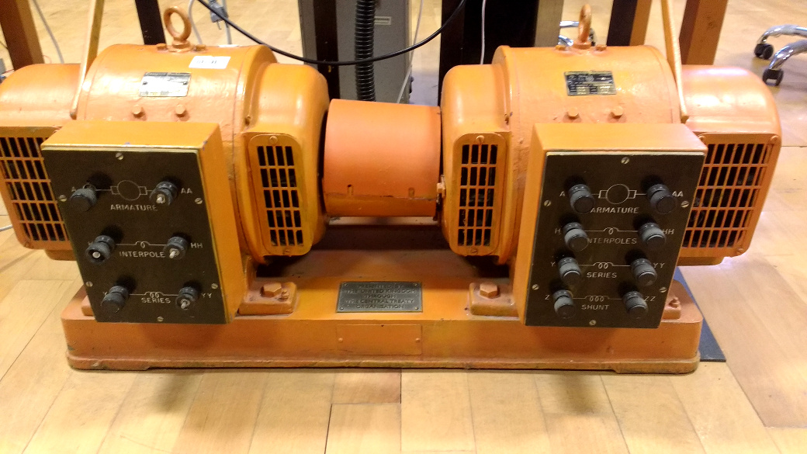
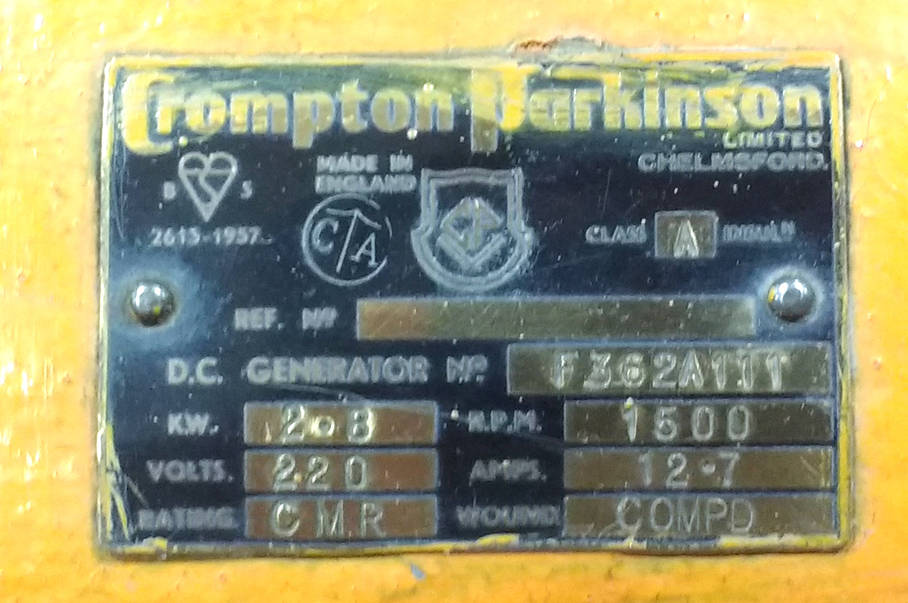

# EE 463 Hardware Project

## AC to DC Motor Drive

### Deadlines:
- Complete Simulation Report and Presentation for Feedback Session - 2nd of December
- Hardware Demo - 23rd of December
- Final Report - 9th of January
- Video - 23th of January

In this project you are required to make a controlled rectifier that will be used to drive a DC Motor.

 - Power Input: 3 Phase, or 1 Phase AC Grid (Adjustable with variac)
 - Output: Adjustable DC Output (Vmax < 180 Vdc)

You are free to choose any topology such as (but not limited to):

 - 3-Phase Thyristor Rectifier
 - 1-Phase Thyristor Rectifier
 - Diode Rectifier + Buck Converter

### Specs:

You are required to drive the following motor(on the left). The motor will be loaded with the generator(on the right) coupled to the generator:

Specs of the all motor windings are measured as follows:

 - **Armature Winding:** 0.8 Ω, 12.5 mH
 - **Shunt Winding:** 210 Ω, 23 H
 - **[Interpoles](https://www.quora.com/Electrical-Machines-What-do-interpoles-do-in-DC-motors) Winding:** 0.27 Ω, 12 mH
 - Inertia: TBA

In the project you will be supplied with a separate external DC source to feed the field winding (i.e. separately excited DC machine). However, you are free to make any other connection types such as shunt, series or compound if you want.

You can use the variac to gradually apply AC voltage to your drive, and leave it any value you want, but you can not use variac to control voltage during operation.

### Project Steps:

- Choose your partners: Each group will consist of 3 people. You are free to choose your partners.

- Create a **public repo**: Open a public repo, which you will put all your work into. Please add [me](https://github.com/ozank) and [Furkan](https://github.com/furkankarakaya) as a collaborator.

- Topology Selection: Discuss the advantages and disadvantages of each topology, and decide on a topology. You are required prepare a document to support your decision.

- Computer Simulations: According the your topology selection, you are going to run computer simulations, to prove the performance characteristics of your drive. It is best to simulate as detailed as possible to catch possible hardware problems (for example, how to generate control/gate signals).

- Component Selection: According to your analytical calculations and computer simulations decide on which components you are going to use. Not only choose the power components, but also decide on the control, and auxiliary components. Don't forget to plan logistics, it may take weeks to get some components.

- Implementation: Build a prototype as fast as possible, and keep iterating.

- Final Demo Day: In the demo day, you are expected to present your working prototypes. You are required to start the DC motor from standstill to rated speed under no load (but still you have the inertia, and the friction) and run for 2 minutes. You are allowed to soft start your drive (i.e for charging capacitors etc) with a variac, but variac should not be used to control the voltage while the motor is running.

### Grading

Project Outcomes:
- **Complete Simulation Report (10 pts):** A report that presents your design decisions, computer simulations, and component selection for the all parts of the project. Similar grading rules apply with previous projects (i.e. format, number of commits etc.)

- **Presentation for Feedback Session (10 pts):** Each team should present their topology selection and project design. They should describe how they selected critical components and their plan for design and manufacturing.

- **Demo Day (25 pts):** Each team is expected to present their prototype in the demo day. If you have a prototype, but somehow if it doesn't work on the demo day, you will get zero points from this part. However, if you don't come up with a prototype, or convince me that you put enough effort in building one, you will get zero points from the all hardware project (yes, even if you had the design report).

- **Test Results (15 pts):** This section can be added in to the design report, or submitted as a separate report. It should contain your results with the motor running (data can be collected on the demo day, but preferably earlier) The report can contain any other useful tests (i.e. functionality of the switches, tests with R load etc.)  

- **Final Report (25 pts):** A report that presents your design decisions, computer simulations, and component selection. Similar grading rules apply with previous projects (i.e. format, number of commits etc.)

- **Video (15 pts):** A video telling your story during the design process and project implementation. It is also expected to put a demo of the working prototype. Videos of maximum 3 min should be uploaded to YouTube (or any other online video hosting website). Each team member should appear in the video.

#### Bonus Parts

You can get extra points (up to 25 pts for each) in any of the following:

- **Utilization Bonus:** The voltage and current ratings of each type of power semiconductor you use in the circuitry will be multiplied and then they will be summed to obtain a utilization value. This means the diode you use in the rectifier will be counted for once. Three groups with minimum values will be awarded with extra point.

- **Industrial Design Bonus:** Implement your design in a PCB(or in a neat pertinaks), enclose it in a plastic/metal box (like one of [those](https://www.altinkaya.com.tr/Proje_Kutulari.html), not in a shoe box) and label input/outputs with proper connections for safe operation.

- **Robust Design Bonus:** Boil the water inside 1.6 kW kettle. Kettle will be fed by AC machine, which is mechanically connected to the DC motor driven by you. Your drive should supply minimum 1.6 kW power to the kettle for at least 5 minutes. If you are not aiming for this bonus, your drive has to accelerate the motor from standstill up to rated speed at no-load (but beware of high starting currents).

- **Closed-loop Voltage/Current Control Bonus:** Implement a feedback loop to adjust the output voltage automatically and protect your drive against high currents.

- **Compactness Bonus:** A bonus will be awarded to a project with the smallest volume (including all cabling, control circuitry, filters etc).

- **Simplicity Bonus:** A bonus will be awarded to the simplest solution. Your chance to get this bonus is tiny if you use large filters, several semiconductors, micro-controllers etc.

- **Four-Quadrant Bonus:** Normally you are required to make a single quadrant DC motor drive, but implement a four-quadrant drive to get this bonus.

- **Best Video Bonus:** Just get creative, and try to get a fun and informative video to describe your project progress.

- **Karma Bonus:** This bonus will be awarded to one person who helps most to everyone during the project period. This bonus will be awarded by the results of anonymous voting in the demo day.

### Teams:
Teams I am aware so far

Please let me know your teams and GitHub repos if it is not listed below:

- [Three Pole Machine]():  
 Ogün Altun,
 Emre Deniz Şenel,
 Fahri Türedi
- [Blue Smoke]():  
Paul BROWN,
İbrahim DURU,
Mustafa ŞAHİN
- [3 Phases 1 Company]():
Orhun Taşoğlu,
Kutay Delibaş,
Mert Zeybek
- [M.P.W.U electronics]():
Burak kemal KARA,
Cem DUMAN,
Mert Yaşar AYDIN
- [N.A.M.-I Power]():
Nevzat S. Şenyayla,
Asya Bal,
Muhammed Barış,
Sam Ghassemi
- [Kara Şimşekler]():
Deniz Boran KARACA,
Nurettin ÇAVUŞ,
Ahmet Talat ÖZMÜSLÜMAN
- [No Name]():
Habibullah Koçoğlu,
Cemal Öztürk,
Cemil Ürgüp
- [Ree-Wired]():
Beyhan Türkyılmaz,
Mehmet Gürtekin,
Burak Yalçın
- [Dynamic Power]():
Hamza SOLAK,
Musa YELİ,
Canberk DUMAN

### Frequently Asked Questions

- Do I need to buy all the components?

No, we will provide some mostly used components, but not all of them. Plase check the [available component list](https://github.com/odtu/ee463/blob/master/Hardware-Project/components.md).

- Can I use the lab before demo day?

Yes, you will be able to use power electronics lab. The machinery lab can be used after EE361 lab sessions are finished.

- What equipment will be available for us in the lab?

You will be able to use oscilloscope, power supply, soldering station, function generator and variacs.

- Can I also work at nights in the lab?

Unfortunately, due to safety regulations, you have to work under technician supervision. Only exception is if an assistant already working in the lab after-hours, you can use the lab, but there is no fixed or guaranteed schedule for that.

### Hints:

For all hints please have a look at the [tips document](https://github.com/odtu/ee463/blob/master/Hardware-Project/tips.md).

Have a look at the hardware project presentation by course assistants [here](https://prezi.com/zqhrvmqz0ik5/ee463-hardware-project/).

# Past Years' Projects

### 2018 Teams

- [SPARK Industries](https://github.com/hhintoglu/EE463_Hardware_Project):  Huzeyfe Hintoglu, Sadık Akyar, Muhammed Hakan Karakaya
- [FosFos AG](https://github.com/sametyildirima/FosFos-AG):  Samet Yıldırım, Ozan Can İyier, Furkan Karacabey
- [BiB Power]( https://github.com/ismail-ataseven/BiB-Power): İsmail Ataseven, Berkay Sağlam, Batuhan Bülbül
- [Firing Angels](https://github.com/nailtosun/EE-463-Hardware-Project): Nail Tosun, Ali Aydın, Özgür Ertürk
- [The Third Harmonics](https://github.com/EnesAyaz/EE463-HardwareProject):Furkan Tokgöz, Enes Ayaz, Yasin Durmaz
- [The Mega Hurts](https://github.com/bulbulbahar/EE463_HardwareProject): Bahar Bülbül, Etki Açılan, Hakkı Gülcü
- [K.A.R.P.U.Z.](https://github.com/gurkandyilmaz/EE463-Hardware_Project): Ali Aydın Yamandağ, Gürkan Durmuş Yılmaz, Sonay Ulukaya
- [Freewheeling Co.](https://github.com/anilcanbudak/EE463-Hardware-Project): Anılcan Budak, Cem Akıncı, Murat Çolakoğlu
- [A.N.](https://github.com/nazliogluahmet/EE_463_proje_AN): Ahmet Nazlıoğlu
- [Smart Grid](https://github.com/ivenguzel/EE463-Harware_Project): Saliha İven Güzel, Ekin Su Saçın, Onur Külahlıoğlu
- [METU LELS](https://github.com/yusufselimkaratas/463HardwareProject): Mehmet Elen, Mert Elmas, Yusuf Selim Karataş
- [M.A.N.Power](https://github.com/nevzatsafasenyayla/M.A.N.Power): Nevzat S. Şenyayla, Akın Şavklı, Metehan Kara

### 2017 Teams

- [Kesla Motors: Melisa, Hande, Özgür](https://github.com/ghandeb/KESLA-Motors)
- [FNAG: Hakan S, Ceren, Yusuf](https://github.com/hakansrc/EE463-Hardware-Project)
- [Ripple Warriors: Eralp, Mahmut Enes](https://github.com/MehmetEralpKose/Ripple-Warriors-Hardware-Project-)
- [EMAchines: Ümit Mert, Ekin, Asım](https://github.com/UmitMertCaglar/EE463-Hardware-Project)
- [THD Defenders: Caner, Uğur, Tuna](https://github.com/caneryagci/EE_463-Hardware-Project)
- [Dank Drivers: Mert, Hakan Polat](https://github.com/hakanpolat/EE463--Dank-Drivers)
- [Ankara Instruments: Emin, Özgür, Talgat](https://github.com/emincinalioglu/Ankara-Instruments)
- [Shark Attack: Celal, Abdurrahman, Tugay](https://github.com/celalkavlak/EE463_Hardware_Project)
- [Converting Falcons: Cem, Ayberk Kaan, Olgun](https://github.com/OlgunErdogan/Converting_Falcons)
- [Raşit](https://github.com/rasitgokmen/EE463-Project)

If your name is not listed above, please inform me asap.

### 2017 Videos:

- [Kesla Motors](https://www.youtube.com/watch?v=I-ww9eQDfaU)
- [FNAG](https://youtu.be/eVu52fjexhE)
- [Ripple Warriors](https://drive.google.com/file/d/1-aCfB_sSwF4t1ENeGZwWkp-CMlNDKGck/view)
- [EMAchines](https://www.youtube.com/watch?v=PyMzq8Eca7o)
- [THD Defenders](https://www.youtube.com/watch?v=gRVRT1USEpw)
- [Dank Drivers](​https://youtu.be/Q4zAWDH7_88)
- [Ankara Instruments](https://drive.google.com/open?id=17f6EGrr7mS8Uh7WiCu8BmIiLnXTHfP1c)
- [Shark Attack](​https://drive.google.com/open?id=1OIxgk-Lcdn7AT_PH-EiCHYb63u0lPHV_)
- [Converting Falcons](https://www.youtube.com/watch?v=T0_olXNja7c&feature=youtu.be)
- [Raşit](https://www.youtube.com/watch?v=tHf7YZv6PTA)
