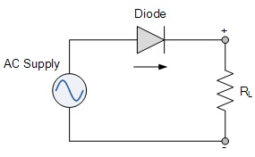

# EE 463 Homework#1

## Diode Rectifiers

### Deadline: 14/11/2019 23:59

Please check [evaluation.md](evaluation.md) for other details and evaluation criteria about the project. Open a **private repository**, which you will put all your work into. Please add [me](https://github.com/tokgozfurkan) as collaborator.

**Important:** While documenting your simulation results, it is often necessary to make visual arrangements on the graph (zoom in/out, axis scales, background colour, markers, etc.). Unless otherwise stated, plot your graphs in steady state and for two electrical periods only. Axes should be properly labelled and visible. It is recommended to use the library (Simscape->Power Systems->Specialized Technology) in Simulink.

**1) Single phase half bridge rectifier** 
Consider the half wave rectifier shown below.

Simulate the circuit fed with a resistive load of R = 80 Ω. Ignore any non-idealities and take AC source as Turkish electricity grid phase-neutral voltage.

**a)** Plot the output voltage waveform for step times of 1 ns, 0.1 ms and 1 ms.

**b)** Comment on the significance of step time in computer simulations. Which one would you prefer for this question? Comment on the advantages and disadvantages of the selection of step time too small or too large.

**c)** Analytically, calculate the output average voltage and input current THD.

**d)** Using simulation tools, obtain the above quantities in part (c). Compare your analytical results with simulation results. Comment on the results.

---

**2) Single phase full bridge diode rectifiers**  
Consider the full bridge rectifier shown below.

**a)** What do Ls and Rs represents in practical applications?

**b)** Using simulation tools, find the minimum output filter capacitance to have 3% output voltage peak-to-peak ripple to mean ratio. Use the values of same AC voltage source in part 1, LS=1.5 mH, RS=0.5 mΩ and RLOAD = 90 Ω. Assume diodes are ideal.

**c)** Plot the output voltage, input voltage and current at the same graph.

**d)** Measure average of output voltage, input current THD and power factor.

**e)** Simulate the same circuit without RS and LS and observe and state the differences. What is the effect of these two?

**3) Three phase full bridge diode rectifiers**  
Consider the three phase rectifier shown below.

**a)** Simulate the circuit for Ls=0, Van, Vbn and Vcn are balanced three phase voltages connected to the same grid as before, ideal diodes and Id=60 A. Plot the output voltage and phase A input current on the same graph.

**b)** Analytically, calculate the output voltage average and compare with simulation results. Comment on any differences.

**c)** Perform the harmonics analysis, i.e. find the harmonic content of output voltage and input current up to 30th harmonic of line frequency. Comment on your findings. (*Hint: Use powergui block for harmonics analysis.*)

**d)** Simulate the same rectifier for Ls=1.5 mH and plot the output voltage and input current. Observe the effect of line inductance and comment on your observations.

**e)** Repeat part (b) with Ls=1.5mH.

**f)** Compare the harmonic content of the input current for different Ls values of 0, 1.5 mH, 15 mH by checking IEEE 519-2014 standard. Which of the line inductance comfort to IEEE harmonics standards? Comment on the differences. What kind of problems can having high input current THD cause to the grid?
