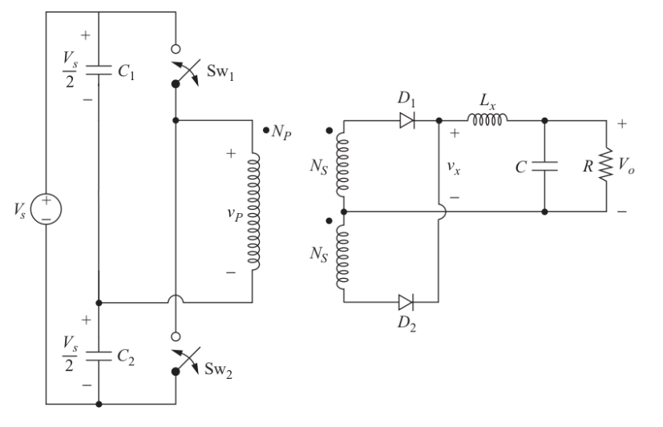

# EE 463 Homework#3

## Half Bridge Isolating Converter Design

### Deadline: 05/01/2025 23:59

Please check [evaluation.md](evaluation.md) for other details and evaluation criteria about the project. Open a **private repository**, which you will put all your work into. Please add [Ogün](https://github.com/OgunAltun) as a collaborator.

You are asked to design a 150 W half bridge isolating converter with 400 Vin and 12 Vout with 1% output voltage ripple. Switching frequency of the converter is 300kHz.

**1) Circuit parameters** 

  **a)** Assuming operating duty cycle is 0.45, find the turns ratio of the transformer.

  **b)** Find the required inductance value so that the filter inductor current ripple is 10% of the average inductor current.

  **c)** Find the output capacitor value to meet the output voltage ripple requirements. Do not just use the formula, show derivation.

  

**2) Magnetic Design** 

The total loss of magnetic components -transformer and inductor- should not exceed 15 W and fill factor of the cores should not be less than 30%.

It is strongly advised to use programs such as Matlab or Excel, since magnetic design can be a tedious job which may require a few iterations to find the optimum parameters. A simple script would save you from losing your precious hours.

  **a)** Design your transformer with cores which can be found on [Magnetics](https://www.mag-inc.com/Products/Ferrite-Cores/Ferrite-Shapes). Clearly indicate the reasoning behind choosing the core. Find the primary and secondary number of turns. Calculate the magnetizing inductance of the transformer. (Hint: Magnetics has some great design guides for inductor and transformer designs. Please have a look at those guidelines.)

  **b)** With current density being 5 A/mm2, find an [AWG cable](https://www.powerstream.com/Wire_Size.htm) according to the switching frequency and current value. Firstly, calculate the fill factor of the transformer with the chosen cable. Is it a reasonable value? Then, calculate the cable DC and AC resistances and copper loss of the transformer (Proximity can be ignored).

  **c)** Calculate the core loss of the transformer using core loss formulas given by the manufacturer and compare it with previously found copper loss value. Does your design require new iterations?

  **d)** Design the output inductor with cores on [Magnetics](https://www.mag-inc.com/Products/Powder-Cores/Kool-Mu-Cores). Find the required number of turns and make sure that core is not saturated by checking the DC bias curves of the material.

  **e)** Choose appropriate AWG cable for the design with 5 A/mm2 current density and calculate the fill factor. Is it a reasonable value? Then, calculate the cable DC and AC resistances and copper loss of the inductor.

  **f)** Calculate the core loss of the inductor and compare it with previously found copper loss value. Does your design require new iterations?

**3) Simulation** 

  **a)** Construct a simulation on PLECS with calculated cable resistances of the inductor and transformer. Check if the circuit meets the requirements. Plot the following waveforms. Comment on the results and explain if you observe any discrepancy from analytical calculations. Also find the required rating of the semiconductors and capacitor according to simulation. Yo do not need to select commercial products for this part.

  * Vo
  * Vx
  * VL
  * iL
  * Vsw1

  **b)** Real transformers have leakage inductances as a small portion of the magnetizing inductance. What would you observe in real case scenario with leakage inductances. Comment on it.

  **c)** Suppose that duty cycle of SW1 is 0.401 and duty cycle of SW2 is 0.399. What could this difference results in? Propose a method to solve this problem.

  **d)** Now construct a more realistic simulation by choosing commercial products and implementing them in your simulation. Add device models to your simulations so that you can see the effects of non-idealities. Then construct a [thermal simulation](https://www.plexim.com/products/plecs/thermal) by chosing appropriate heat sinks for your semiconductors. Present your findings. You can mention following points but describe your findings in more detail.

  * Comparison of Vo with results of part-a.
  * Loss distribution of the circuit.
  * Results of thermal simulation such as junction temperatures over time.
  * Effect of heatsink thermal resistance.
