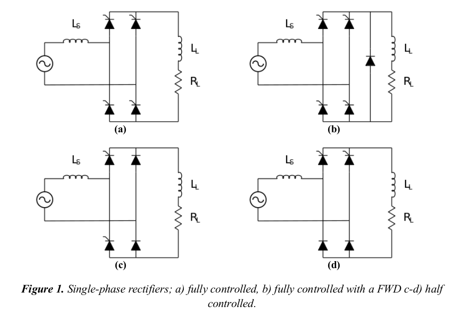
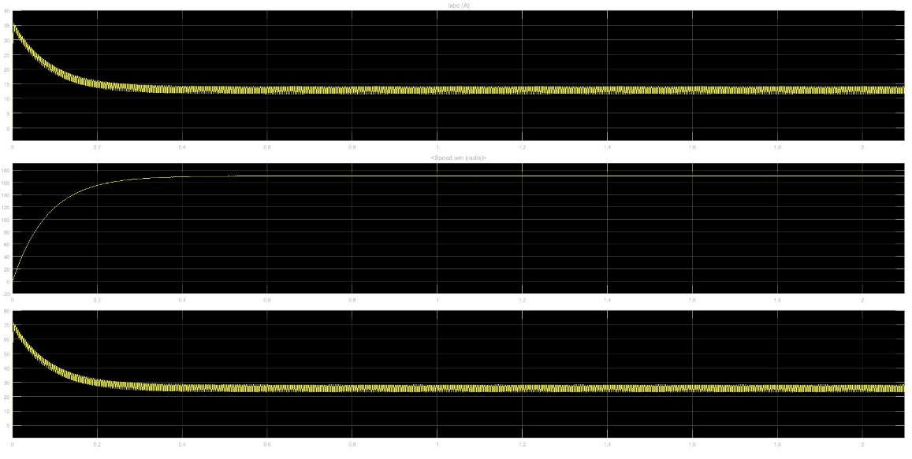

# EE 463 PROJECT#2

## Controlled Rectifiers

### Deadline: 06/12/2017 23:59

Please check [evaluation.md](evaluation.md) for other details and evaluation criteria about the project.

Throughout this homework, assume the rectifiers are connected to Turkish grid (400 V l-l, 50 Hz). Note that, single-phase rectifiers are connected to Phase-Neutral. When a single-phase diode rectifier is mentioned, it is energized with a phase and neutral connection.

### Q1) Single Phase Controlled Rectifier

Consider the single phase rectifier topologies shown below:

where RL = 4 Ω, LL = 200 mH, Ls = 0.5 mH.

**a)** Calculate analytically the required firing angle α which results in an average output current value of 40 A for all of the topologies listed above, and verify your calculations with simulations.

**b)** Plot Vs and Is on the same graph and find the THD value of Is for the topologies.

**c)** Compare the topologies wrt to their advantages, disadvantages and their application areas. Discuss their operational similarities and differences.

### Q2) DC Motor Drive

A DC motor is fed from a three-phase grid via a three phase full bridge diode rectifier. Mechanical load driven by the motor is fixed at 25 N.m. Motor data is as follows:

- Armature resistance, Ra = 10 Ω
- Armature inductance, La = 0.1 H
- Field resistance, Rf = 300 Ω
- Field inductance, Lf = 156 H
- Field-armature mutual inductance, Laf = 2 H

Other necessary data for the system is as follows:

- Diode forward voltage, Vf = 0.8 V
- Diode on resistance, Ron = 20 mΩ
- Source inductance, Ls = 100 µH
- Source resistance, Rs = 100 mΩ

You can assume default values (of Simulink block), for any parameters not mentioned. For this step, you can use an auxiliary DC power supply providing 300 V for the field excitation.

**a)** Plot armature current, speed and torque like the one shown below. Find line current THD (at the steady state).

**b)** Comment on characteristics (ie frequency, magnitude etc ) ofthe torque ripple.

**c)** Propose two methods in order to reduce the torque ripple below 10% of the average torque. Simulate the methods and discuss pros and cons of these methods.

**d)** Eliminate the auxiliary DC supply used for the field excitation. Field winding is now excited by the rectifier output. Use a suitable resistor to limit the current so that the average field current is the same with the previous situation. Repeat the part (a) and comment.

**e)** Find the overall drive efficiency (mechanical power output / electric power in). Identify the sources of power loss and make a chart that shows percent share of each loss type.

## Q3) Alternative Rectifier Topologies

Consider the power conversion topology depicted below:

**a)** Find the name of the topology and describe its operation and application areas. If you find other variations of this power conversion topology, briefly state them and discuss the differences.

**b)** Compare this topology with the full bridge diode rectifier by simulating them both. For a good comparison, arrange the operating conditions such that they both produce the same average output voltage and average load current values for a resistive load of 10 Ω. Discuss pros and cons.

**Hints:** 

- Do not forget to include “powergui” box to your model.

- You can find the DC motor model from Simscape → Power Systems → Special Technology → Fundamental Blocks → Machines

- For the AC source, use “Three-Phase Source” block.

- There may be different resistor, capacitor, inductor models some of which may be inoperable with your models. Search for “Series RLC Branch” when you need to model a passive element (it can be arranged to any R, L, C or their combinations).

**Important:** While documenting your simulation results, it is often
necessary to make visual arrangements on the graph (zoom in/out, axis
scales, background color, markers etc..). When plotting a periodic
signal, a few repetitions of the full period is enough, i.e. do not plot
a 50 Hz waveform for several seconds as it makes no sense. Unless it is
stated otherwise, document only the steady state values.
