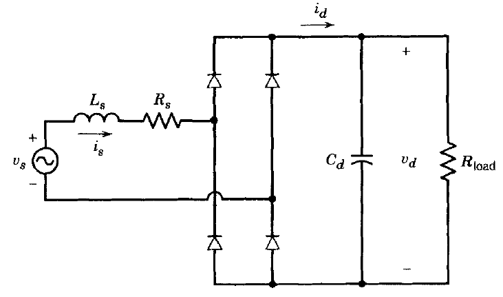

# EE 463 PROJECT#1

## Single Phase Diode Rectifiers

### Deadline: 01/11/2020 23:59

Please check [evaluation.md](evaluation.md) for other details and evaluation criteria about the project. Open a **private repository**, which you will put all your work into. Please add Furkan T.(/tokgozfurkan), Furkan K.(/furkankarakaya) as a collaborator.

**Important:** While documenting your simulation results, it is often
necessary to make visual arrangements on the graph (zoom in/out, axis
scales, background color, markers etc..). Unless otherwise stated, plot your graphs in steady state and for two periods only. Axes should be properly labeled and visible.
It is recommended to use the library (Simscape->Power Systems->Specialized Technology) in Simulink.

**1) Single phase half bridge rectifier** 
Consider the half wave rectifier shown below.

Simulate the circuit fed with a resistive load of R = 60 Ω. Ignore any non-idealities and take AC source as Turkish Electricity Grid phase-neutral voltage.

**a)** Plot the output voltage waveform for step times of 4ns, 0.4ms and 4ms.

**b)** Comment on the significance of step time in computer simulations. Which one would you prefer for this question? Comment on the advantages and disadvantages of the selection of step time too small or too large.

**c)** Analytically, calculate the output average voltage and input current THD.

**d)** Using simulation tools, obtain the above quantities in part (c). Compare your analytical results with simulation results. Comment on the results.

---

**2) Single phase full bridge diode rectifiers**  
Consider the full bridge rectifier shown below.

**a)** What do Ls and Rs represents in practical applications?

**b)** Using simulation tools, find the minimum output filter capacitance to have 3% output voltage peak-to-peak ripple to mean ratio. Use the values of VS=230VRMS AC at 50Hz, LS=1.3mH, RS=0.8mΩ and RLOAD = 70Ω. Assume diodes are ideal.

**c)** Plot the output voltage, input voltage and current at the same graph.

**d)** Measure average of output voltage, input current THD and power factor.

**e)** Simulate the same circuit without RS and LS and observe and state the differences. What is the effect of these two?

**f)** Observe and record the stresses on the diodes for the case on part (e). Pick a real diode using manufacturers' datasheet.

**Hint:** When you need to find a commercial product, you can search the database of “Digikey”, which is a big retailer for electronic components, from [**Digikey.com**](https://www.digikey.com/). 
*Alternatively, you can search other big retailers such as Farnell and Mouser.*

**g)** Input the selected diode parameters into the simulation, then measure the rectifier efficiency for the case in part (e). How the parameters affect the losses?

---

**3) Feedback (Bonus)**  
How much time did you spend for this homework?
