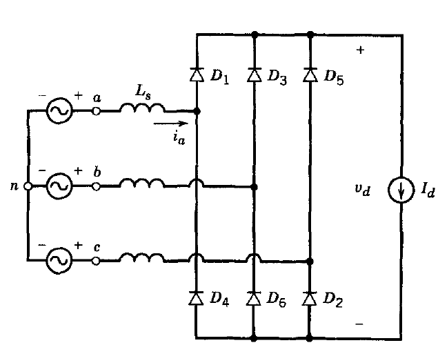

# EE 463 PROJECT#2

## Three Phase Diode Rectifiers

### Deadline: 10/11/2019 23:59

Please check [evaluation.md](evaluation.md) for other details and evaluation criteria about the project. Open a **private repository**, which you will put all your work into. Please add Furkan T.(/tokgozfurkan), Furkan K.(/furkankarakaya) as a collaborator.

**Important:** While documenting your simulation results, it is often
necessary to make visual arrangements on the graph (zoom in/out, axis
scales, background color, markers etc..). Unless otherwise stated, plot your graphs in steady state and for two periods only. Axes should be properly labeled and visible.
It is recommended to use the library (Simscape->Power Systems->Specialized Technology) in Simulink.

---

**1) Three phase full bridge diode rectifiers**  
Consider the three phase rectifier shown below.

**a)** Simulate the circuit for Ls=0, Van, Vbn and Vcn are balanced three phase voltages with rms of 230V at 50 Hz, ideal diodes and Id=40 A. Plot the output voltage and phase A input current on the same graph.

**b)** Analytically, calculate the output voltage average and compare with simulation results. Comment on any differences.

**c)** Perform the harmonics analysis, i.e. find the harmonic content of output voltage and input current up to 30th harmonic of line frequency. Comment on your findings. (*Hint: Use powergui block for harmonics analysis.*)

**d)** Simulate the same rectifier for Ls=1.2 mH and plot the output voltage and input current. Observe the effect of line inductance and comment on your observations.

**e)** Repeat part (b).

**f)** Compare the harmonic content of the input current for different Ls values 0, 1.2 mH, 12 mH cases. Comment on the differences.

**g)** Lets say a variable load is connected to the output port in parallel with a DC-link capacitor as given in the figure above. The DC link capacitor is a 100 μF aluminum electrolytic capacitor. What happens to the load voltage if the load current suddenly drops or suddenly increases? Simulate the following cases and comment on them.

* The load current has a step change from 40 A to 5 A with line inductances (1.2 mH) and without line inductances.

* The load current has a step change from 5 A to 40 A with line inductances (1.2 mH) and without line inductances.

Apply step changes at the steady state for both cases. Plot the output voltage waveform and the line current waveform together.

---

**2) Feedback (Bonus)**  
How much time did you spend for this homework?
