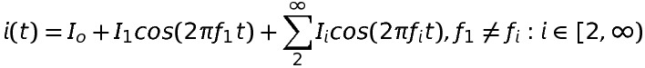
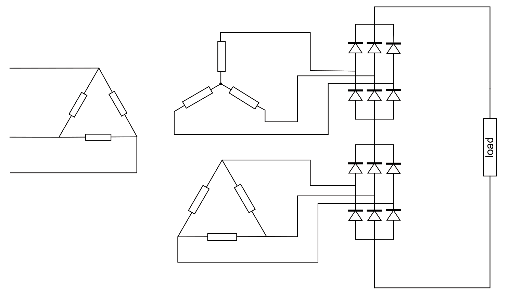

# EE 463 PROJECT#3

## Understanding Power and Controlled Rectifiers

### Deadline: 28/11/2019 23:59

Please check [evaluation.md](evaluation.md) for other details and evaluation criteria about the project. Open a **private repository**, which you will put all your work into. Please add me(/ozank), Furkan(/furkankarakaya) or Gökhan(/gkhnckl) as a collaborator.

**1) Active Power Creation** 
 **a)** Let's say you have a voltage source supplying a current such as

  
 

Calculate the supplied active power of this voltage source. Indicate the components creating active power.

*Even though having clear steps is important, you do not need to show each step in calculations. You can be direct reasonably.*

**b)** What is the rule of thumb to create nonzero active power?

**2) Understanding Active and Reactive Power** 

You have the following circuit where the load resistance is 10-ohms and thyristor can be considered as ideal.

 
  *Suggestion: You can use TemplateForQ2.slx file for the simulations*

**a)** Apply a gate signal synchronized with your voltage supply, i.e., non-delayed pulses. Using power measurement block (Simscape / Power Systems / Simscape Components / Control / Measurements), find supplied or consumed active and reactive power of source and load. Give active power of supply & load in a table up to 9th harmonic.

  *i)* Is active power conserved harmonicwise, why? 
  *ii)* Is reactive power conserved from source to load?

**b)** Apply a gate signal with 5 ms delay using Transport Delay block. Please give the active and reactive power tables up to 9th harmonic for any component that you comment on.

  *i)* Is active power conserved?  
  *ii)* Is reactive power conserved from source to load? Explain the difference from the part (ii) of (a).  
  *iii)* Is reactive power conserved harmonicwise in a circuit?  
  *iv)* Is apparent power conserved from source to load?  
  *v)* Is power factor conserved from source to load?  

**c)** Change the load with an R-L load where resistance is 10-ohms and inductance is 10 mH. Give the active and reactive power tables up to 9th harmonic for supply and load.

*i)* By looking at reactive power table of supply and load, what can you say about their power factors? 
*ii)* What is the power factor of the supply? 
*iii)* Calculate the load power factor using the load parameters. Does it match with the simulation result? What are the displacement power factor and harmonic power factor of the load? 

**3) Single Phase Controlled Rectifier** 

Consider the single phase rectifier topologies shown below:

where RL = 5 Ω, LL = 250 mH, Ls = 0.5 mH.

**a)** Calculate analytically the required firing angle α which results in an average output current value of 30 A for both topologies given above, and verify your calculations with simulations.

**b)** Plot Vs and Is on the same graph and find the THD value of Is for both topologies.

**c)** Compare the topologies with respect to their advantages, disadvantages and their application areas. Discuss their operational similarities and differences.

**4) Alternative Rectifier Topologies (Bonus)** 

Consider the power conversion topology depicted below:

**a)** Find the name of the topology and describe its operation and application areas. If you find other variations of this power conversion topology, briefly state them and discuss the differences.

**b)** Compare this topology with the full bridge diode rectifier by simulating them both. For a good comparison, arrange the operating conditions such that they both produce the same average output voltage and average load current values for a resistive load of 10 Ω. Discuss pros and cons.

**5) Feedback (Bonus)** 

How much time did you spend for this homework?
