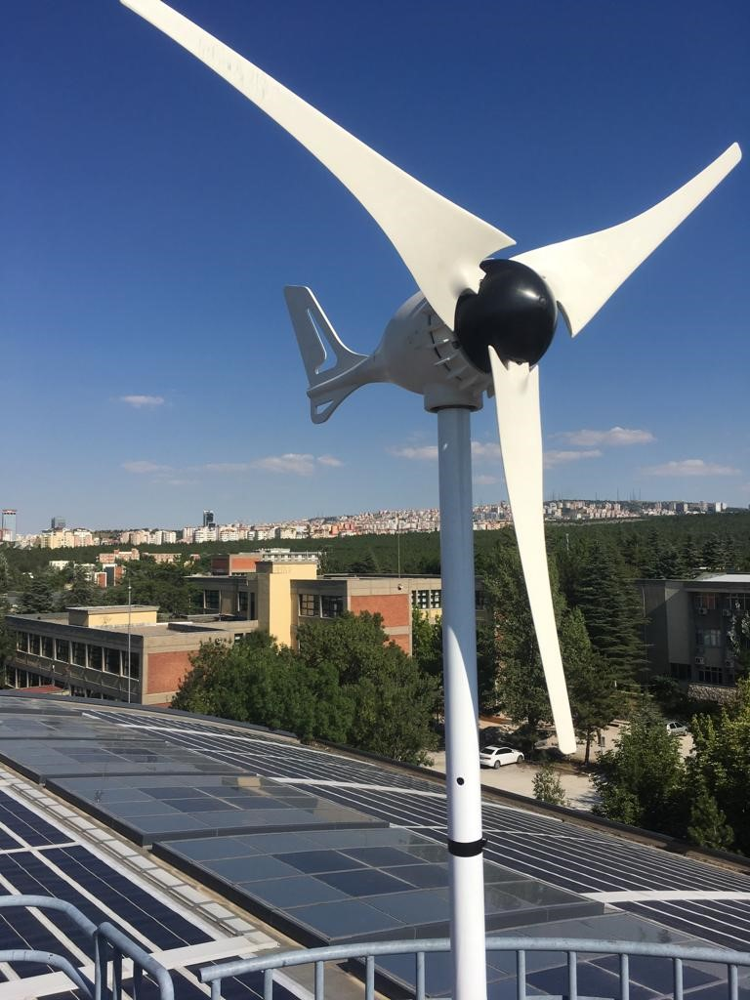
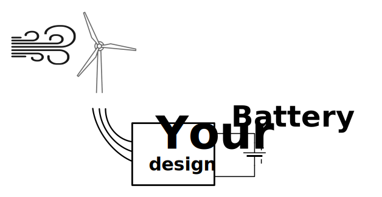

# EE 463 Hardware Project

## Wind Turbine Controller

### Deadlines:
- Simulation Report and Presentation for Feedback Session - 25th of December
- Final Report - 15th of January
- Final Presentation - 23th of January
- Video - 25th of January

You are free to choose any topology such as (but not limited to):
 - 3-Phase Thyristor Rectifier
 - Diode Rectifier + Buck Converter

### Project Description:

 The road next to the park of our department needs to be illuminated to increase safety for drivers at nights. However, an electrical supply is not available to feed the lamp at that height. Therefore, a small wind turbine generator is being used to turn-on the light during the nights. Since the wind profile is not constant over a night, a lead-acid battery is used to store and supply energy whenever it is required.

 

 Your help is required to regulate the incoming power from wind turbine generator to feed the load and charge the battery. Thus, an AC to DC type power converter circuit has to be designed with required control actions because there are limitations for batteries in terms of their voltage and charge. Propose a solution which can regulate the output current while the input voltage is varied because of the changing wind speed.

 

### Specs:

Specifications of the system are listed as follows:

 - **Open circuit voltage peak**: 330 Vline-to-line
 - **Battery capacity**: 13 Ah
 - **Battery nominal voltage**: 24 V
 - **Output current**: 2 A
 - **Output current ripple**: %20 of average current
 - **Inertia**: 0.00027 kg.m^2
 - **Viscous Damping**: 0.005024 N.m.s
 - **Poles**: 2
 - **Voltage Constant**: 110 Vpeakl-l/krpm
 - **Stator Resistance**: 10.58 Ohm
 - **Armature Inductance**: 16.7 mH

### Project Steps:

- Choose your partners: Each group will consist of 3 people. You are free to choose your partners.

- Create a **public repo**: Open a public repo, which you will put all your work into. Please add [Keysan](https://github.com/ozank), [Tokgöz](https://github.com/tokgozfurkan), and [Karakaya](https://github.com/furkankarakaya)  as a collaborator.

- Topology Selection: Discuss the advantages and disadvantages of each topology, and decide on a topology. You are required prepare a document to support your decision.

- Analytical Calculations: After choosing a suitable topology for this case, you need to calculate the circuit parameters such as values of inductors and capacitors, duty cycle, firing angle, maximum voltage and current ratings of the circuit components.

- Component Selection: According to your analytical calculations decide on which components you are going to use. Not only choose the power components, but also decide on the control, and auxiliary components. Use [Digikey](https://www.digikey.com/) as your supplier and record the cost of the components. Loss -switching, conduction- calculations of the components should be done, after the component selection is completed.  With calculated thermal loss values, find the temperature of the components by assuming 25&deg;C ambient temperature. If necessary select a heatsink and do the thermal calculations again. If you use any magnetic component, you should choose a magnetic core from [Magnetics](https://www.mag-inc.com/) or any other supplier and do the necessary calculations.

- Simulations: According the your topology selection, you are going to run computer simulations, to prove the performance characteristics of your circuit. Simulate the circuit with all the parasitic elements that you can add to the simulation. An ideal case simulation will not be accepted. Construct a closed loop control system by choosing a suitable control method.  A template for the simulation is added to the project repo.

- Implementation: Using PCB design softwares such as KiCad, Altium Designer, Proteus, construct the schematic of your design. Add all footprints and 3D models of the components that you have used. Then, draw the PCB layout of the designed circuit while concerning practical usage. Some [tips](http://www.onmyphd.com/?p=pcb.design) about PCB layout can be helpful in this part of the project. Add 3D model of the circuit components. You can use following websites to find 3D models: [Snapeda](https://www.snapeda.com/), [3D Content](https://www.3dcontentcentral.com/).

### Grading

- **Complete Simulation Report (15 pts):** A report that presents your design decisions, computer simulations, and component selection for the all parts of the project. Similar grading rules apply with previous projects (i.e. format, number of commits etc.)

- **Presentation for Feedback Session (15 pts):** Each team should present their topology selection and project design. They should describe how they selected critical components and their plan for design and manufacturing.

- **Simulation & PCB Design (20 pts):** This section can be added in to the design report, or submitted as a separate report.

- **Final Report (25 pts):** A report that presents your design decisions, computer simulations, and component selection. Similar grading rules apply with previous projects (i.e. format, number of commits etc.)

- **Final Presentation (25 pts):** Each team is expected to present their designs.

#### Bonus Parts

There will be bonuses for some groups -not necessarily to a single group-. You can get extra points (up to 25 pts for each) in any of the following:

- **Utilization Bonus:** The voltage and current ratings of each type of power semiconductor you use in the circuitry will be multiplied and then they will be summed to obtain a utilization value. This means the diode you use in the rectifier will be counted for once. Three groups with minimum values will be awarded with extra point.

- **Industrial Product Bonus:** A bonus will be awarded to a project with the smallest volume (including all cabling, control circuitry, filters etc). This bonus will apply to those students who put 3D models to their PCB design. You should put the circuit in a box, whose examples can be found in this [website](https://www.altinkaya.com.tr/). When calculating volume of the design, volume of the box will be used.

- **Cheapest Design Bonus:** A bonus will be awarded to design with the cheapest unit price. You should find the costs of all the circuit components that your are going to use in Digikey for 1000 pieces and offer a Bill of Materials (BOM). You should also include the cost of PCB  using [PCBway](https://www.pcbway.com/) for again 1000 pieces.

- **Thermal Simulation Bonus:** This bonus will be given to students who run a thermal simulation on a CAD program such as Autocad, Solidworks etc. You should use the 3D model of your PCB and thermal loss calculations to run the simulations. If you are using a heatsink, you should add the heatsink model as well.

- **Best Video Bonus:** Just get creative, and try to get a fun and informative video to describe your project progress. A video telling your story during the design process and project implementation. Videos of maximum 3 min should be uploaded to YouTube (or any other online video hosting website). Each team member should appear in the video.

- **Karma Bonus:** This bonus will be awarded to one person who helps most to everyone during the project period. This bonus will be awarded by the results of anonymous voting in the demo day.

### Frequently Asked Questions

### Hints:

For all hints please have a look at the [tips document](https://github.com/odtu/ee463/blob/master/Hardware-Project/tips.md).

Have a look at the hardware project presentation by course assistants [here](https://prezi.com/zqhrvmqz0ik5/ee463-hardware-project/).

# Past Years' Projects

### 2020 Teams

- [Kardeşler Elektronik A.Ş](https://github.com/EnesCanbolat/EE463-Project): Enes Canbolat, Emin Un,  Berkay Uzun
- [Power Quality](https://github.com/alpercak/EE463_TermProject.git): Mustafa Mert SARIKAYA, Alper ÇAKIROĞLU, Fatih Serdar SAĞLAM
- [Power Guide](https://github.com/busranurkocak/EE463-Term-Project): Eren ÖZKARA, Yunus ÇAY, Büşranur KOÇAK
- [Distanced Power Solutions Inc.](https://github.com/ceyhunkocc/EE463-TermProject.git): Ceyhun KOÇ, Defnenur KORKMAZ, Görkem GÜLLETUTAN
- [Unlimited Power!](https://github.com/onuroztas1/EE463_Project_Onur_Halis_Halid.git): Ahmet Halis Sabırlı, Halid Filiz, Onur Öztaş, Emre Karabakla
- [Deadly Viper Assassination Squad Inc.](https://github.com/mehmetkl/EE463-Term-Project.git): Mustafa Yıldız, Ali Belli, Mehmet Kılıç

### 2020 Videos

- [Kardeşler Elektronik A.Ş](https://www.youtube.com/watch?v=OPD5CQ3YGrg&feature=youtu.be) (Best Video Bonus Winner)
- [Power Guide](https://www.youtube.com/watch?v=6BUnYYQThP8&feature=youtu.be) (Best Video Bonus Winner)
- [Distanced Power Solutions Inc.](https://www.youtube.com/watch?v=rCTESrjsp6w&ab_channel=CeyhunKo%C3%A7) (Best Video Bonus Winner)
- [Unlimited Power!](https://www.youtube.com/watch?v=Rinxe8KxoEA&feature=youtu.be) (Best Video Bonus Winner)
- [Deadly Viper Assassination Squad Inc.](https://www.youtube.com/watch?v=vXrl2gbuGQM) (Best Video Bonus Winner)

### 2019 Teams

- [Three Pole Machine](https://github.com/edsenel/ThreePoleMachine): Ogün Altun, Emre Deniz Şenel,  Fahri Türedi
- [Blue Smoke](https://github.com/pdb5627/ee463-hardware-project): Paul BROWN, İbrahim DURU, Mustafa ŞAHİN
- [3 Phases 1 Company](https://github.com/m-zeybek/3P1C_Hardware_Project): Orhun Taşoğlu, Kutay Delibaş, Mert Zeybek
- [M.P.W.U electronics](https://github.com/MERTAYDIN46/EE463_HardwareProject-M.P.W.U-electronics-): Burak kemal KARA, Cem DUMAN, Mert Yaşar AYDIN
- [N.A.M.-I Power](https://github.com/sammalek0/EE463-HardwareProject-N.A.M-I-Power): Nevzat S. Şenyayla, Muhammed Barış, Sam Ghassemi
- [Kara Şimşekler](https://github.com/nurettincavus/463karasimsekler): Deniz Boran KARACA, Nurettin ÇAVUŞ
- [Ostim Rectifiers](https://github.com/CemilUrgup/EE463-Hardware-Project-Ostim-Rectifiers): Habibullah Koçoğlu, Cemal Öztürk, Cemil Ürgüp
- [Ree-Wired](https://github.com/buryalcin/ReeWired): Beyhan Türkyılmaz, Mehmet Gürtekin, Burak Yalçın
- [Dynamic Power](https://github.com/musayeli/463-HARDWARE-Project): Hamza SOLAK, Musa YELİ, Canberk DUMAN

### 2019 Videos

- [Three Pole Machine](https://www.youtube.com/watch?v=YZUBasKc0Og)
- [3 Phases 1 Company](https://www.youtube.com/watch?v=jqYrZNpZuFA)
- [M.P.W.U electronics](https://www.youtube.com/watch?v=vqz0xIiDz8E)
- [N.A.M.-I Power](https://www.youtube.com/watch?v=fzA787_wp4Y) (Best Video Bonus Winner)
- [Kara Şimşekler](https://drive.google.com/file/d/1u6mGx2txVA8GeNq95FOMn25f3ItVCYUt/view)
- [Ostim Rectifiers](https://www.youtube.com/watch?v=GmYoqUheJWo)
- [Ree-Wired](https://www.youtube.com/watch?v=QtswupaRqzg)
- [Dynamic Power](https://www.youtube.com/watch?v=q_Ks-do5HX4)

### 2018 Teams

- [SPARK Industries](https://github.com/hhintoglu/EE463_Hardware_Project):  Huzeyfe Hintoglu, Sadık Akyar, Muhammed Hakan Karakaya
- [FosFos AG](https://github.com/sametyildirima/FosFos-AG):  Samet Yıldırım, Ozan Can İyier, Furkan Karacabey
- [BiB Power]( https://github.com/ismail-ataseven/BiB-Power): İsmail Ataseven, Berkay Sağlam, Batuhan Bülbül
- [Firing Angels](https://github.com/nailtosun/EE-463-Hardware-Project): Nail Tosun, Ali Aydın, Özgür Ertürk
- [The Third Harmonics](https://github.com/EnesAyaz/EE463-HardwareProject):Furkan Tokgöz, Enes Ayaz, Yasin Durmaz
- [The Mega Hurts](https://github.com/bulbulbahar/EE463_HardwareProject): Bahar Bülbül, Etki Açılan, Hakkı Gülcü
- [K.A.R.P.U.Z.](https://github.com/gurkandyilmaz/EE463-Hardware_Project): Ali Aydın Yamandağ, Gürkan Durmuş Yılmaz, Sonay Ulukaya
- [Freewheeling Co.](https://github.com/anilcanbudak/EE463-Hardware-Project): Anılcan Budak, Cem Akıncı, Murat Çolakoğlu
- [A.N.](https://github.com/nazliogluahmet/EE_463_proje_AN): Ahmet Nazlıoğlu
- [Smart Grid](https://github.com/ivenguzel/EE463-Harware_Project): Saliha İven Güzel, Ekin Su Saçın, Onur Külahlıoğlu
- [METU LELS](https://github.com/yusufselimkaratas/463HardwareProject): Mehmet Elen, Mert Elmas, Yusuf Selim Karataş
- [M.A.N.Power](https://github.com/nevzatsafasenyayla/M.A.N.Power): Nevzat S. Şenyayla, Akın Şavklı, Metehan Kara

### 2017 Teams

- [Kesla Motors: Melisa, Hande, Özgür](https://github.com/ghandeb/KESLA-Motors)
- [FNAG: Hakan S, Ceren, Yusuf](https://github.com/hakansrc/EE463-Hardware-Project)
- [Ripple Warriors: Eralp, Mahmut Enes](https://github.com/MehmetEralpKose/Ripple-Warriors-Hardware-Project-)
- [EMAchines: Ümit Mert, Ekin, Asım](https://github.com/UmitMertCaglar/EE463-Hardware-Project)
- [THD Defenders: Caner, Uğur, Tuna](https://github.com/caneryagci/EE_463-Hardware-Project)
- [Dank Drivers: Mert, Hakan Polat](https://github.com/hakanpolat/EE463--Dank-Drivers)
- [Ankara Instruments: Emin, Özgür, Talgat](https://github.com/emincinalioglu/Ankara-Instruments)
- [Shark Attack: Celal, Abdurrahman, Tugay](https://github.com/celalkavlak/EE463_Hardware_Project)
- [Converting Falcons: Cem, Ayberk Kaan, Olgun](https://github.com/OlgunErdogan/Converting_Falcons)
- [Raşit](https://github.com/rasitgokmen/EE463-Project)

### 2017 Videos:

- [Kesla Motors](https://www.youtube.com/watch?v=I-ww9eQDfaU)
- [FNAG](https://youtu.be/eVu52fjexhE)
- [Ripple Warriors](https://drive.google.com/file/d/1-aCfB_sSwF4t1ENeGZwWkp-CMlNDKGck/view)
- [EMAchines](https://www.youtube.com/watch?v=PyMzq8Eca7o)
- [THD Defenders](https://www.youtube.com/watch?v=gRVRT1USEpw)
- [Dank Drivers](​https://youtu.be/Q4zAWDH7_88)
- [Ankara Instruments](https://drive.google.com/open?id=17f6EGrr7mS8Uh7WiCu8BmIiLnXTHfP1c)
- [Shark Attack](​https://drive.google.com/open?id=1OIxgk-Lcdn7AT_PH-EiCHYb63u0lPHV_)
- [Converting Falcons](https://www.youtube.com/watch?v=T0_olXNja7c&feature=youtu.be)
- [Raşit](https://www.youtube.com/watch?v=tHf7YZv6PTA)
